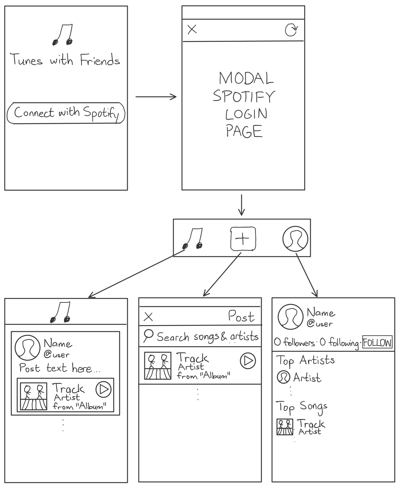

# Original App Design Project - Tunes with Friends

## Table of Contents
1. [Overview](#Overview)
1. [Product Spec](#Product-Spec)
1. [Wireframes](#Wireframes)
2. [Schema](#Schema)

## Overview
### Description
Tunes with Friends is a social networking app designed to connect Spotify users with similar music taste.

### App Evaluation
- **Category:** Social
- **Mobile:** For the past decade, social networking has been a mobile-first experience. This app will integrate audio samples of songs and location services to fetch nearby concerts.
- **Story:** Music lovers have yet to be served by an interactive social experience. The Spotify app does not actively make its social features visible on mobile, nor promote connection with other users.
- **Market:** This app's target user base is devoted music fans who would like to connect with others who share their passion for music. They listen frequently, like discovering new music, and may attend their favorite artists' concerts.
- **Habit:** This app's average usage varies by user, ranging from daily use by the most devoted music lovers to weekly or less frequent usage by more casual music fans. Devoted music fans are likely to post often, whereas causal users may post infrquently or not at all.
- **Scope:** The most technically challenging aspect of this app is building interactive features, such as song samples from the Spotify API and sharing lyrics snippets from a separate lyrics API.

## Product Spec

### 1. User Stories (Required and Optional)

**Required Must-have Stories**

* User can login with their Spotify account.
* User can see an overview of each user's top artists and songs on their profile page.
* User can post song samples from Spotify.
* User can comment on other users' posts.
* User can follow other users and see other users' posts on their feed.

**Optional Nice-to-have Stories**

* *User can post snippets of song lyrics.*
* *User can view the the song currently being listened to by another user on their profile page.*
* *User can add tags to their posts.*
* *User can search for other users and artists.*
* *User can search for posts with specific tags.*
* *User can view upcoming nearby concerts on an artist's page.*
* *User can tap a button on an artist's page to express their intent to attend a concert.*

### 2. Screen Archetypes

* Login Screen
   * User can login with their Spotify account.
* Feed
   * User can follow other users and see other users' posts on their feed.
* Post Details Screen
   * User can comment on other users' posts.
* *Search*
   * *User can search for other users and artists.*
   * *User can search for posts with specific tags.*
* Post Creation Screen
   * User can post song samples from Spotify.
   * *User can post snippets of song lyrics.*
   * *User can add tags to their posts.*
* Profile
   * User can see an overview of each user's top artists and songs on their profile page.
   * *User can view the the song currently being listened to by another user on their profile page.*
* *Artist Page*
   * *User can view upcoming nearby concerts on an artist's page.*
   * *User can tap a button on an artist's page to express their intent to attend a concert.*

### 3. Navigation

**Tab Navigation** (Tab to Screen)

* Feed
* *Search*
* New Post
* Profile

**Flow Navigation** (Screen to Screen)

* Login Screen
   * => Feed
* Feed
   * => Post Details Screen
   * => Profile
* Post Details Screen
   * => Profile
   * => Artist Page
* *Search*
   * => Post Details Screen
   * => Profile
   * => Artist Page
* Post Creation Screen
   * => Feed
* Profile
   * => Artist Page
* *Artist Page*
   * => *Search (for viewing posts with relevant tags)*

## Wireframes

## Schema 

### Models
#### Parse
**Post**
| Property | Type | Description |
| - | - | - |
| objectId | String | unique id for each post |
| author | Pointer to User | post author |
| text | String | text entered by author |
| track | Pointer to Track | song selected by the author for the post |
| numLikes | Number | number of users that liked the post |
| numComments | Number | number of comments associated with the post |
| comments | Array of Comments | array of comments associated with the post
| createdAt | DateTime | date and time when post created |
| updatedAt | DateTime | date and time when post properties last updated |

**Comment**
| Property | Type | Description |
| - | - | - |
| objectId | String | unique id for each comment |
| post | Pointer to Post | post associated with the comment
| author | Pointer to User | comment author |
| text | String | text entered by author |
| numLikes | Number | number of users that liked the comment |
| createdAt | DateTime | date and time when comment created |
| updatedAt | DateTime | date and time when comment properties last updated |

**User**
| Property | Type | Description |
| - | - | - |
| objectId | String | unique id for each user |
| accessToken | String | used in calls to Spotify's API |
| accessExpiration | DateTime | date and time when Spotify access token expires |
| refreshToken | String | used for requesting new access tokens from Spotify's API |
| username | String | user's selected username, which matches their Spotify username by default |
| displayName | String | user's selected display name |
| profileImage | File | user's selected profile image |
| posts | Array of Posts | array of posts created by the user |
| followers | Array of Users | array of users who follow the specified user |
| following | Array of Users | array of users who the specified user follows |
| topArtists | Array of Strings | array of Spotify IDs corresponding to user's top artists |
| topSongs | Array of Strings | array of Spotify IDs corresponding to user's top songs |
| createdAt | DateTime | date and time when user account created |
| updatedAt | DateTime | date and time when user account properties last updated |

#### Spotify API Wrapper
**Track**
| Property | Type | Description |
| - | - | - |
| id  | NSString | Spotify ID for the track |
| name | NSString | title of the track |
| artist | Artist* | artist of the track |
| album | NSString | title of the album on which the track appears |
| coverArt | NSURL | cover art for the album on which the track appears |
| audioSample | NSURL | 30 second MP3 sample of the track |

**Artist**
| Property | Type | Description |
| - | - | - |
| id | NSString | Spotify API for the artist |
| name | NSString | name of the artist |
| profileImage | NSURL | image of the artist |

### Networking
* Login Screen
   * (Create/POST) Register a new user in Parse
   * (Read/GET) Request access and refresh tokens from Spotify
   * (Read/GET) Retrieve logged in user from Parse
* Feed
   * (Read/GET) Query posts from users followed by the current user
   * (Update/PUT) Increase/decrease like count for a post
* Post Details Screen
   * (Create/POST) Create a new comment for a post
   * (Delete) Delete existing comment
   * (Update/PUT) Increase/decrease comment count for a post
* Post Creation Screen
   * (Read/GET) Query songs and artists from Spotify
   * (Create/POST) Create new post in Parse
* Profile
   * (Read/GET) Retrieve info about user's top artists and songs from Spotify
   * (Read/GET) Retrieve user's username, display name, and profile image
* Artist Page
   * *TBD*

- [Create basic snippets for each Parse network request]
- [OPTIONAL: List endpoints if using existing API such as Yelp]